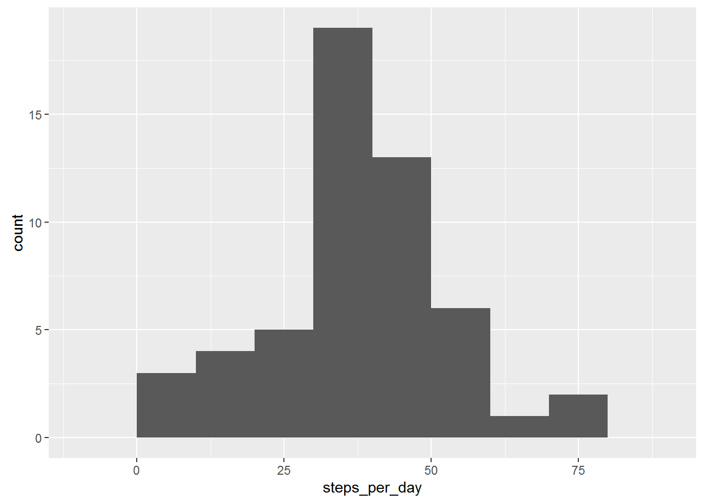

# Reproducible Research: Peer Assessment 1


## Loading and preprocessing the data
To start, lets unzip our csv file and read the data into r variable 

```r
unzip("activity.zip")
activity_data <- read.csv("activity.csv")
```
__Done!__

## What is mean total number of steps taken per day?

To calculate the mean we have to:

* split steps data by date
* calculate number of steps for every date
* calculate the mean


```r
splited <- split(activity_data$steps, activity_data$date)
steps_per_day <- sapply(splited, mean)
```

Let's draw a histroam of steps per day:

```r
library(ggplot2)
qplot(steps_per_day, geom="histogram", binwidth=10, na.rm = TRUE)
```

 

Let's continue and find mean of steps per day:

```r
mean_steps_per_day <- mean(steps_per_day, na.rm = TRUE)
mean_steps_per_day
```

```
## [1] 37.3826
```
Let's calculate median too:

```r
median_steps_per_day <- quantile(steps_per_day, 0.5, na.rm = TRUE)
median_steps_per_day
```

```
##      50% 
## 37.37847
```

**Done!**

## What is the average daily activity pattern?

## Imputing missing values


## Are there differences in activity patterns between weekdays and weekends?
