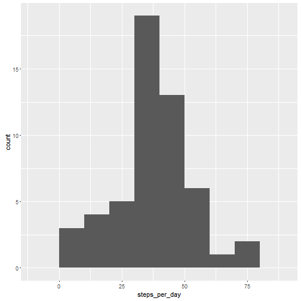
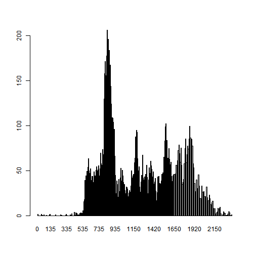
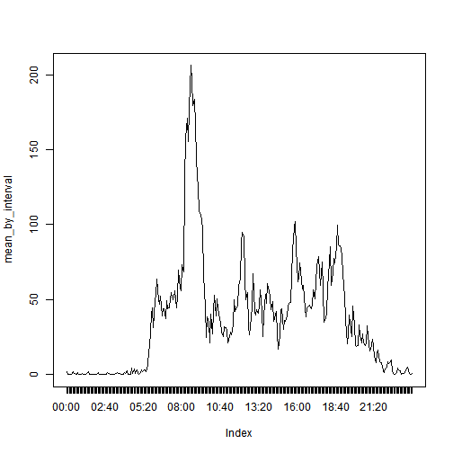
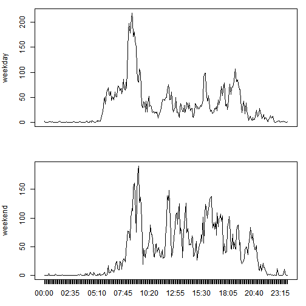

## Loading and preprocessing the data
To start, lets unzip our csv file and read the data into r variable 

```r
unzip("activity.zip")
activity_data <- read.csv("activity.csv")
```
__Done!__

## What is mean total number of steps taken per day?

To calculate the mean we have to:

* split steps data by date
* calculate number of steps for every date
* calculate the mean


```r
splited <- split(activity_data$steps, activity_data$date)
steps_per_day <- sapply(splited, mean)
```

Let's draw a histroam of steps per day:

```r
library(ggplot2)
qplot(steps_per_day, geom="histogram", binwidth=10, na.rm = TRUE)
```

 

Let's continue and find mean of steps per day:

```r
mean_steps_per_day <- mean(steps_per_day, na.rm = TRUE)
mean_steps_per_day
```

```
## [1] 37.3826
```
Let's calculate median too:

```r
median_steps_per_day <- quantile(steps_per_day, 0.5, na.rm = TRUE)
median_steps_per_day
```

```
##      50% 
## 37.37847
```

**Done!**

## What is the average daily activity pattern?

```r
splited_by_interval <- split(activity_data$steps, activity_data$interval)
mean_by_interval <- sapply(splited_by_interval, mean, na.rm = T)
barplot(mean_by_interval)
```

 

Let's a little bit polish our intervals' names:

```r
labels <- sapply(names(mean_by_interval), function(s){
    if (nchar(s) < 2){
        s<-paste("000", s, sep = "")
    }
    else if(nchar(s) < 3){
        s<-paste("00", s, sep="")
    }
    else if(nchar(s)<4){
        s<-paste("0",s, sep="")
    }
    paste0(substr(s,1,2), ":", substr(s,3,4))
})
```

And draw our plot eventually

```r
plot(mean_by_interval, type = "l", xaxt="n")
axis(1, at = seq(1:288), labels = labels)
```

 

We also can find an interval with the biggest average of steps (that's easy):

```r
max(mean_by_interval)
```

```
## [1] 206.1698
```

## Imputing missing values

Let's calculate total number of missing values:

```r
missing_values <- nrow(activity_data[!complete.cases(activity_data),])
```

Let's devise our strategy for filling in all of the missing values in the dataset as:
1. Split values by interval.  
2. If some value is missing, let $s_{d,i} = s_{d - 1, i} + s_{d + 1, i}$, where $s$ is for steps, $d$ is for day and $i$ is for interval.  
3. If one of adjustent values is missing too, we replace missing value with another adjustent value.


```r
svi <- splited_by_interval
splited_by_interval <- data.frame(splited_by_interval)
for (i in 1:ncol(splited_by_interval)){
    if (is.na(splited_by_interval[1,i])){splited_by_interval[1,i] <- splited_by_interval[2, i]}
    for (j in 2:nrow(splited_by_interval)){
        if (is.na(splited_by_interval[j, i])){
            if (is.na(splited_by_interval[j + 1, i])){
                splited_by_interval[j, i] <- splited_by_interval[j-1, i]
            }
            else{
                splited_by_interval[j, i] <- (splited_by_interval[j-1, i] + splited_by_interval[j+1, i])/2
            }
        }
    }
}
```

Now we have to insert our new data into a copy of the original data set

```r
new_data <- activity_data
```
Easy to find that  ```splited_by_interval[i, j]``` refers to ```activity_data[(i-1)*288 + j, 1]```:


```r
for (i in 1:61){
    new_data[((i-1) * 288 + 1):(i * 288) , 1] <- unlist(splited_by_interval[i, ], use.names = F)
}

head(new_data)
```

```
##   steps       date interval
## 1     0 2012-10-01        0
## 2     0 2012-10-01        5
## 3     0 2012-10-01       10
## 4     0 2012-10-01       15
## 5     0 2012-10-01       20
## 6     0 2012-10-01       25
```

## Are there differences in activity patterns between weekdays and weekends?

First of all, let's make a function, that defines, wether a day is a weekday or a weekend:

```r
is_weekend <- function (s){
    if ((s == "Sunday") || (s == "Saturday")){ ## Only those are weekends in my country =(
        "weekend"
    }
    else{
        "weekday"
    }
}
```
Then we need some r-magic:
1. We make a factor variable, that assigns weekday/weekend to all our dates. 
2. After that we create a new column in our new dataset (the one, without missing values)

```r
date_factors <- factor(tapply(weekdays(as.Date(new_data$date)), INDEX = new_data$date, FUN = is_weekend))
new_data$weekend <- date_factors[new_data$date]
head(new_data)
```

```
##   steps       date interval weekend
## 1     0 2012-10-01        0 weekday
## 2     0 2012-10-01        5 weekday
## 3     0 2012-10-01       10 weekday
## 4     0 2012-10-01       15 weekday
## 5     0 2012-10-01       20 weekday
## 6     0 2012-10-01       25 weekday
```

Finally, we draw a panel plot containing interval (x-axis) and the average number of steps taken, averaged across all weekday days or weekend days (y-axis). 


```r
par(mfrow = c(2,1))
par(mar = c(3, 4, 1, 1))
final_means <- tapply(new_data$steps, list(new_data$interval, new_data$weekend), mean)
plot(final_means[1:288], type="l", xaxt = "n", ylab = "weekday")
plot(final_means[289:(288*2)], type="l", xaxt = "n", ylab = "weekend")
axis(1, at = seq(1:288), labels = labels)
```

 
